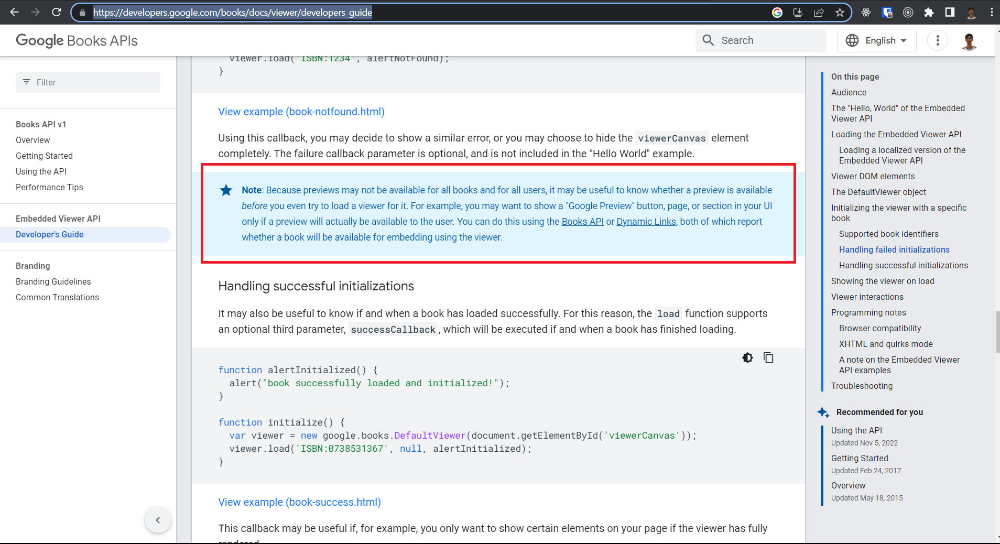
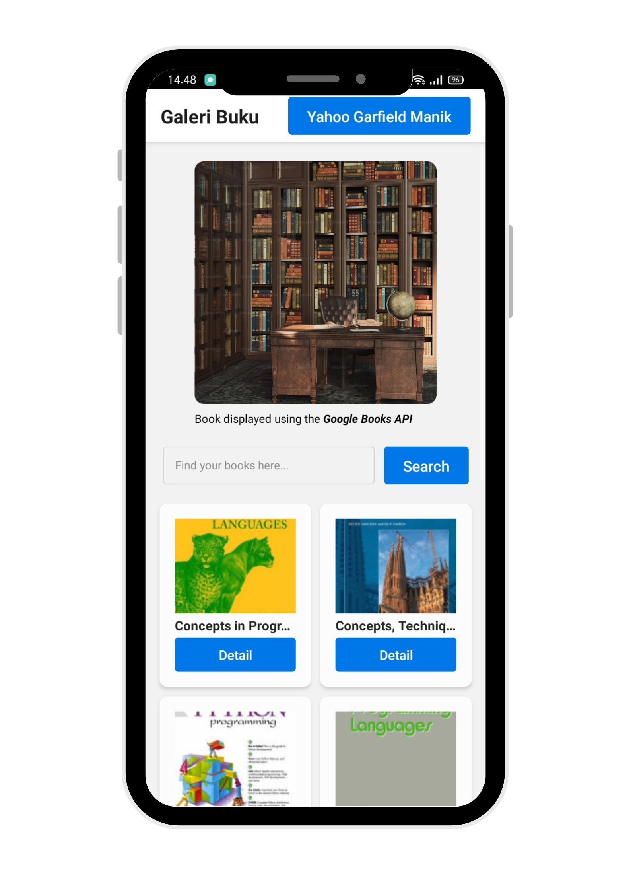
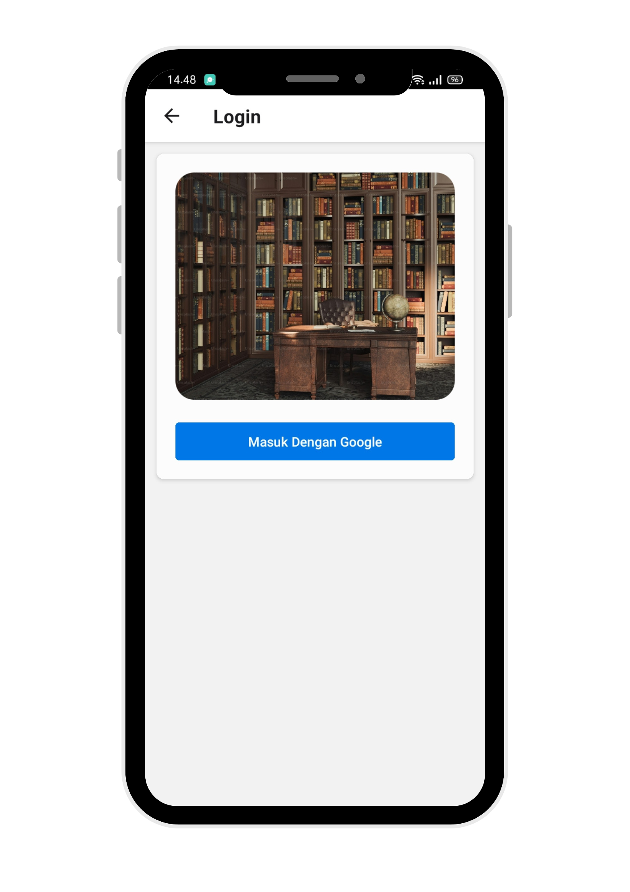
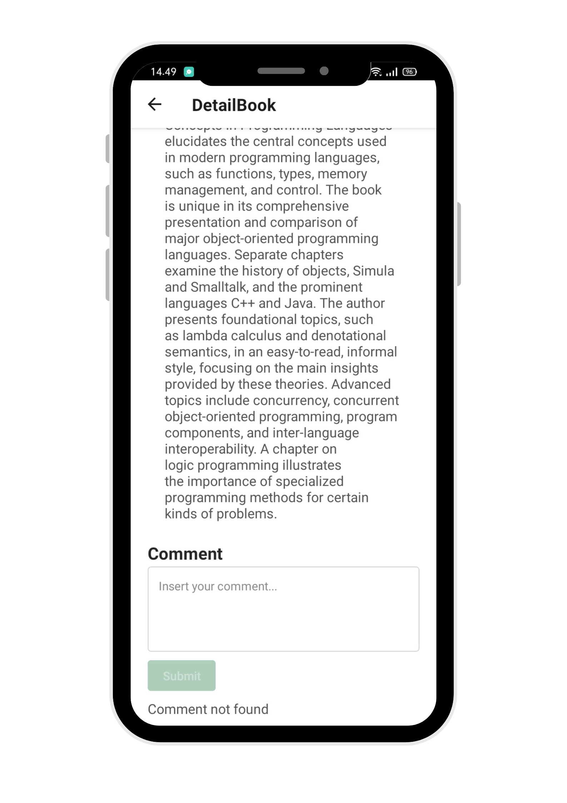

# Books Gallery

# About The Project

This application books gallery application was built to make it easier for people who like to read to more easily access books, because the system is online, where we don't have to go to a bookstore. You can read books directly in the application because the <a href="https://developers.google.com/books/docs/v1/getting_started" target="blank">Google Books API</a> provides an embedded viewer feature, but not all books can be read directly, for the reason I don't know for sure but the sentence is explained in the following Google Book API documentation.

### Preview Home

### Preview Login

### Preview Detail Book

### Preview Comment

### Demo app

# Build With

